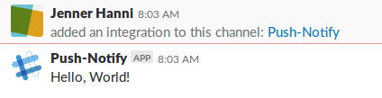
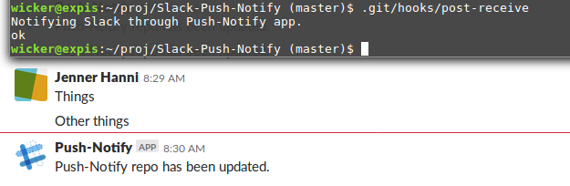

# Slack-Push-Notify
Slack app that notifies about git pushes.

## Design Notes

Using the [Slack Apps docs](https://api.slack.com/slack-apps).

Created the app called `Push-Notify` on my workspace. For now, this will just be private to my workspace. 

Features: 

- Uses as incoming webhook

Future: 

- Richly format the message
- Supports slash commands
- Add OAuth support

### Incoming Webhooks

The app will look for a post-commit git webhook in the related repo, which is this one, for now. Webhooks are regular HTTP requests with a JSON payload. 

Flipped the right switches in the Slack API. These are great docs so far...

Added a webhook to my workspace and tried the example: 

```
curl -X POST -H 'Content-type: application/json' --data '{"text":"Hello, World!"}' <hook url here>
```



### Adding Git Hook to Repository

Referring to [Git documentation](https://github.com/git/git/blob/master/Documentation/githooks.txt#L295)

The server-side post-push hook is called `post-receive`:

```
This hook is invoked by linkgit:git-receive-pack[1] when it reacts to `git push` and updates reference(s) in its repository. It executes on the remote repository once after all the refs have been updated.
```

Reviewed the [git/contrib/hooks/multimail](https://github.com/git/git/tree/master/contrib/hooks/multimail) post-receive hook example.

Just use Bash for this for now to make that curl call.

We're exposing that webhook URL so there's a potential for abuse, but this is a demo for today and I'll disable the webhook in a few hours.

Here's the new `post-receive` webhook, chmodded to 755:

```
#!/bin/bash

echo Notifying Slack through Push-Notify app.

curl -X POST -H 'Content-type: application/json' --data '{"text":"Push-Notify repo has been updated."}' <hook url here>
```

Now to test the hook...

Interesting! It works when run in the terminal, but not when the README is updated and pushed. Here's the result in Slack from the terminal command: 



Double checked permissions, which are correct. 

This push has the README and a new image, so the post-receive hook should fire.

Oh! Code's on Github, which won't let me run server-side code. That's okay, though, for now I'll move it to a post-commit hook by changing the name of the file.

Test results: IT WORKS.

